# Phenomate — Frontend ↔ Backend Sequence Diagrams

> The endpoint paths and operation names in these diagrams are taken from the uploaded `urls.txt` export of your BE API.

---

## Table of Contents
- [1) Project listing & bulk actions](#1-project-listing--bulk-actions)
- [2) Create project (lookup reference data → submit)](#2-create-project-lookup-reference-data--submit)
- [3) Project detail + activities tab](#3-project-detail--activities-tab)
- [4) Single activity detail & actions (cancel / retry)](#4-single-activity-detail--actions-cancel--retry)
- [5) Offload data for a project (export job)](#5-offload-data-for-a-project-export-job)
- [6) Home/index (optional helpers)](#6-homeindex-optional-helpers)
- [Appendix: One‑glance map (pages → endpoints)](#appendix-oneglance-map-pages--endpoints)

---

## 1) Project listing & bulk actions
**Pages**: `src/routes/index.tsx`, `src/routes/project.index.tsx`, `src/routes/-project.index.tables.tsx`

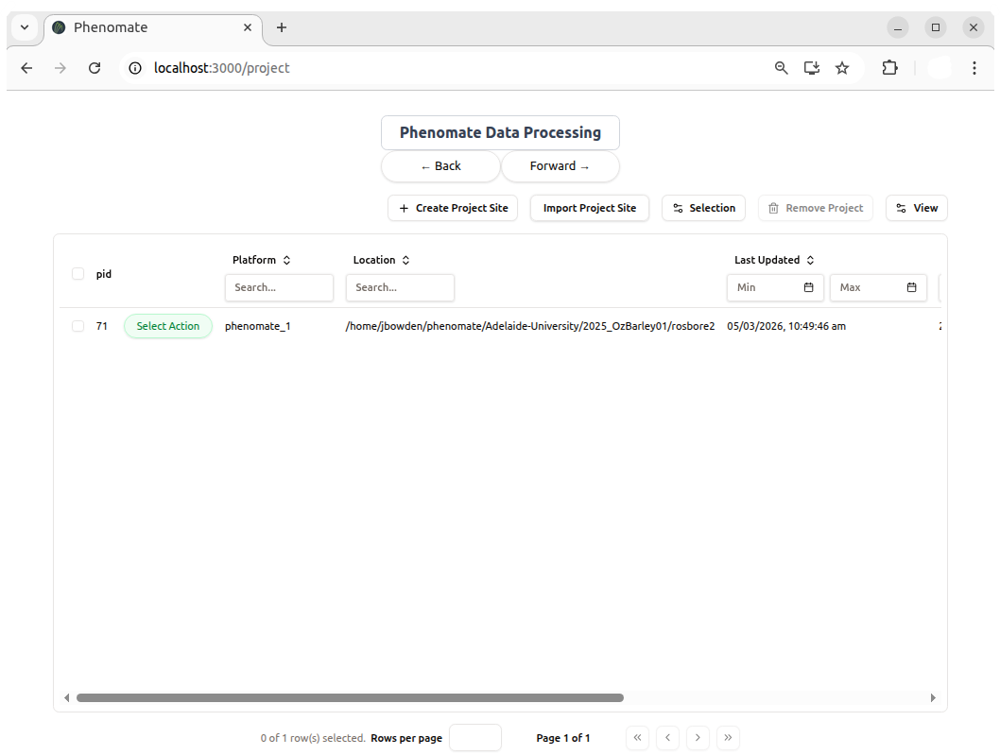

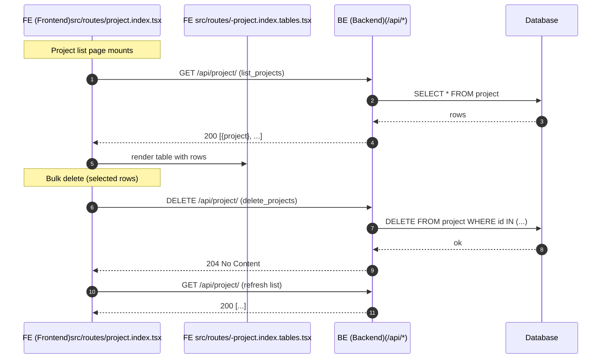

---

## 2) Create project (lookup reference data → submit)
**Page**: `src/routes/project.create.tsx`

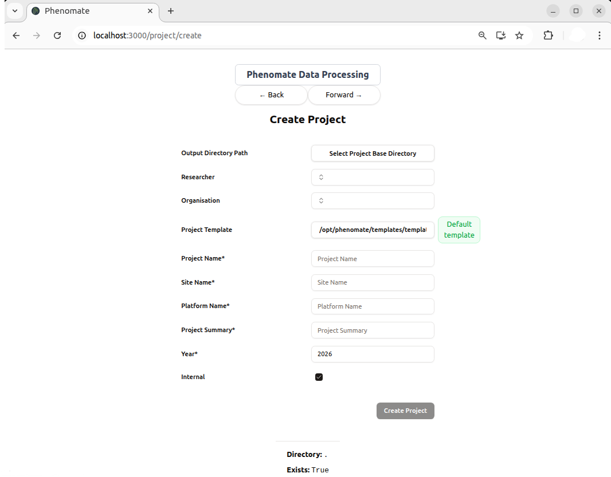

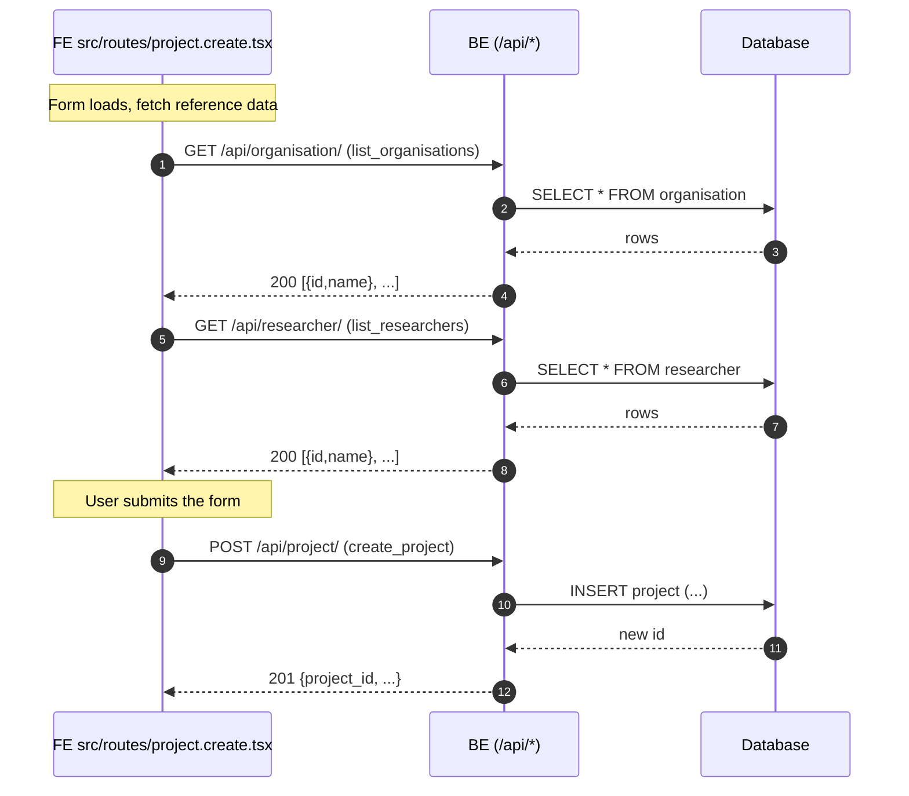

---

## 3) Offload data for a project (export job)
**Pages**: `src/routes/project.$projectId.offload.tsx`, `src/routes/-project.offload.tables.tsx`

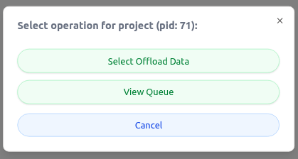

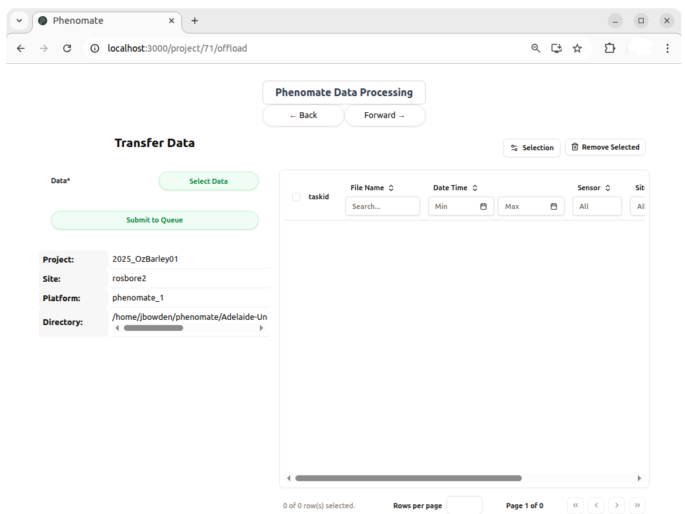

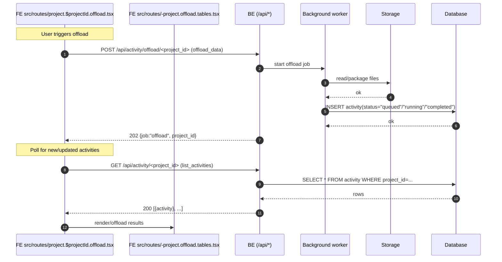

---

## 4) Project detail + activities tab
**Pages**: `src/routes/project.$projectId.activities.tsx`, `src/routes/-project.activities.tables.tsx`

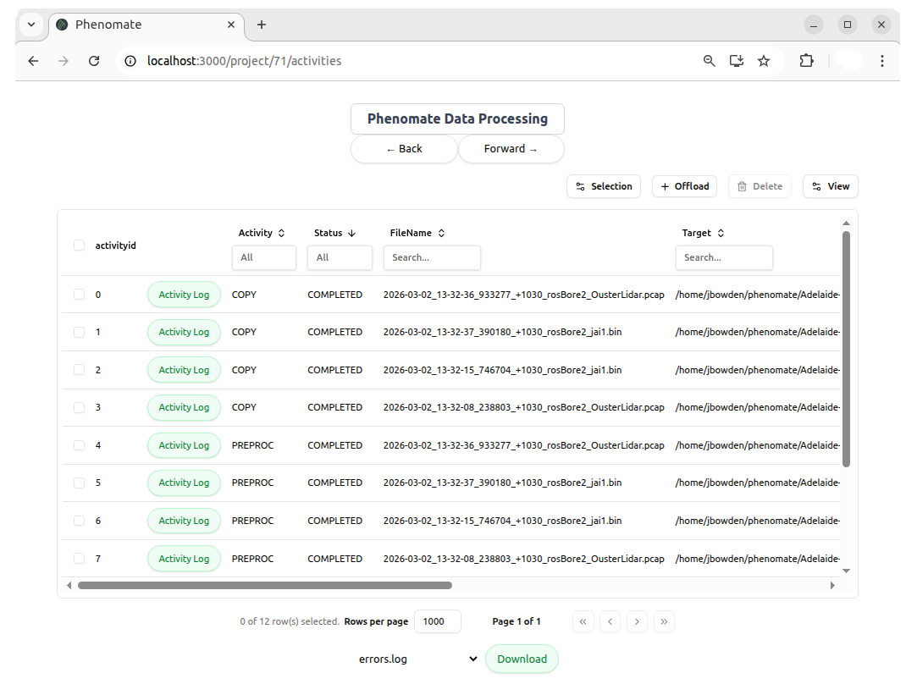

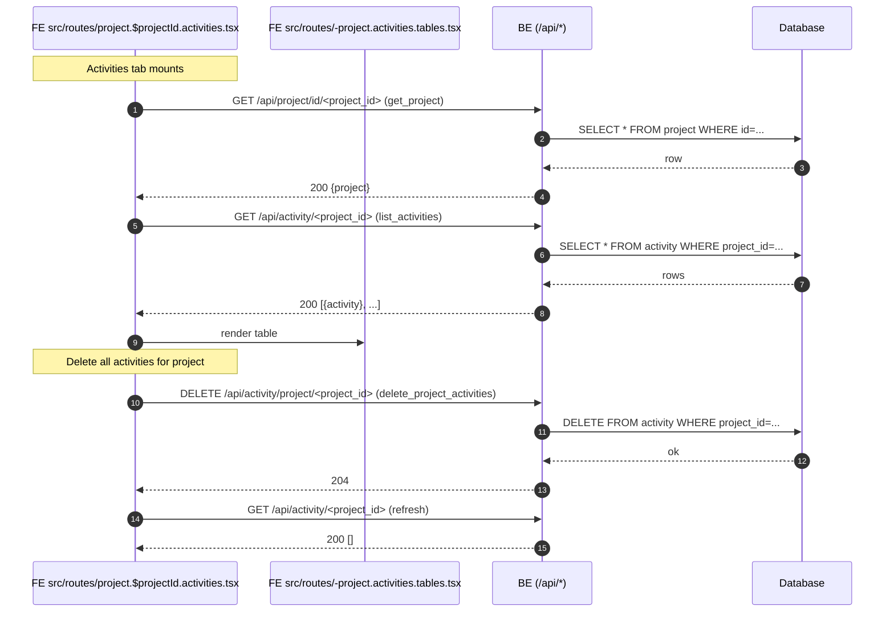

---

## 5) Single activity detail & actions (cancel / retry)
**Page**: `src/routes/activity.$activityId.tsx`

> Endpoints reflected below are from `urls.txt`. 

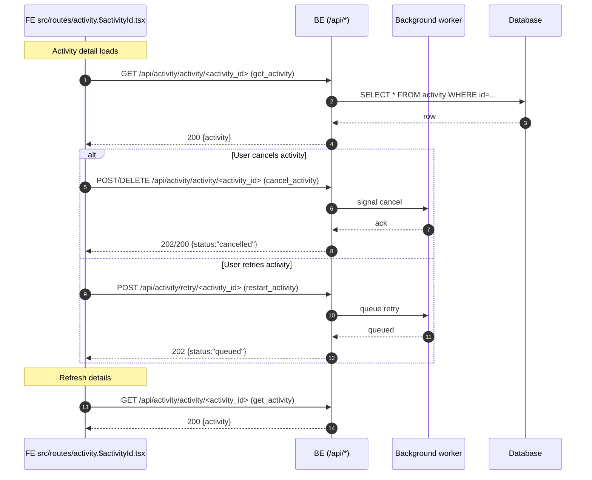

---

## 6) Home/index (optional helpers)
**Pages**: `src/routes/index.tsx`, `src/routes/__root.tsx`

> Endpoints reflected below are from `urls.txt`. 

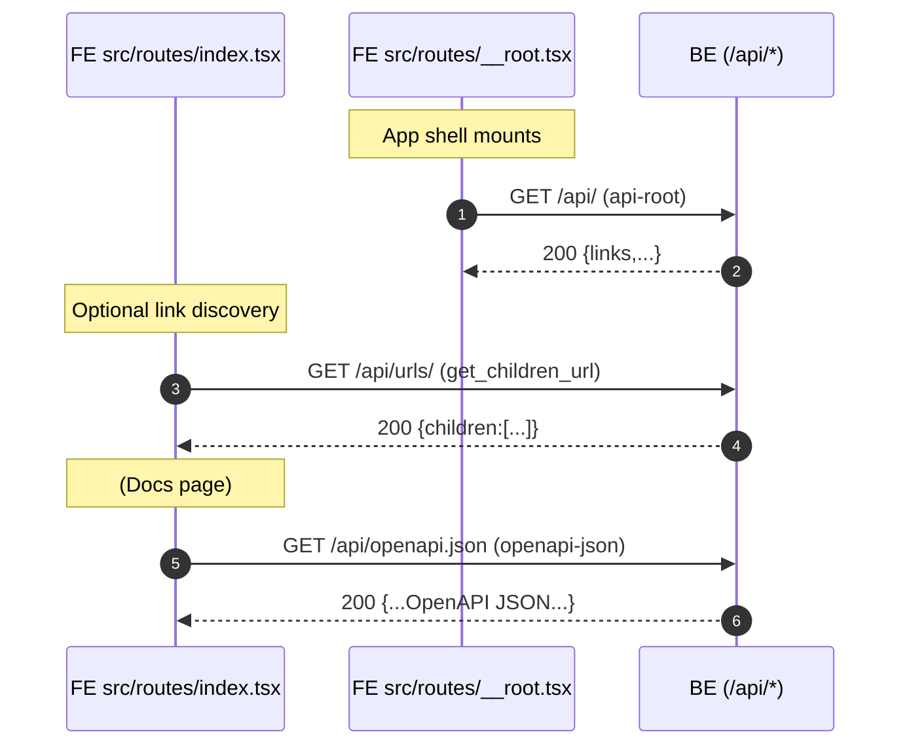

---

## Appendix: One‑glance map (pages → endpoints)
> Endpoints reflected below are from `urls.txt`. 

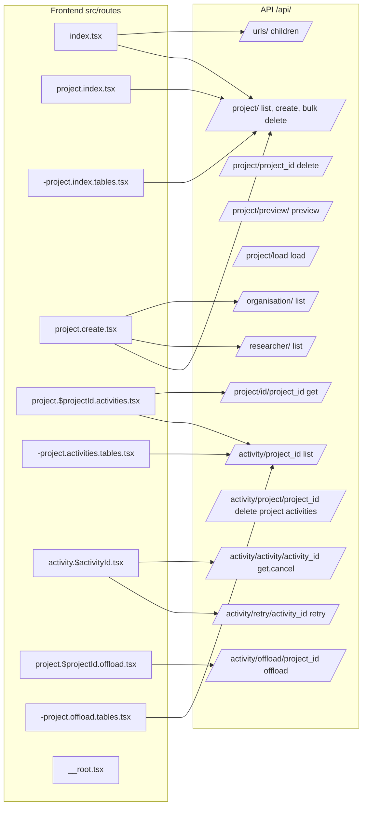

---

### Notes
- Where HTTP verbs weren’t explicit in `urls.txt`, methods are inferred from operation names (e.g., `list_*` → GET, `create_*` → POST, `delete_*` → DELETE). Adjust if your view definitions differ. citeturn16search1
- Replace or extend the FE page labels if you later refactor `src/routes/*`.
